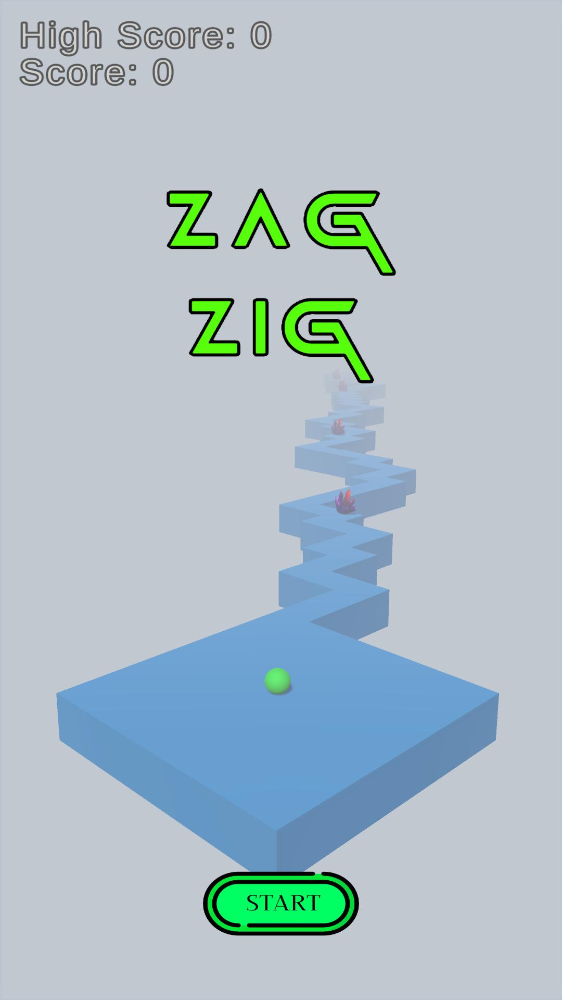

# ZagZig
 

    

 

## Introduction

This project is a ZigZag Game Clone developed using Unity. The main goal of the game is to get the highest possible score without falling off the platform. The player earns extra points by collecting crystals on the platform.

  

   
   

## Features
1. Platform Pool System:

     &nbsp;&nbsp;&nbsp; Platforms that the player passes fall off and are reused by being added to the front of the path.

2. Increasing Difficulty:

     &nbsp;&nbsp;&nbsp; The ball speeds up as the game progresses, making it more challenging.

3. Color Changes:

     &nbsp;&nbsp;&nbsp; The ball, platform, and HeaderText in the StartMenu change colors randomly every 5 seconds.

4. Crystal System:

     &nbsp;&nbsp;&nbsp; Players earn +30 points for each crystal they collect.

5. State Machine Implementation:

     &nbsp;&nbsp;&nbsp; Game states (StartMenu, InGame, GameOver) are managed using a State Machine system.
   
6. DOTween Integration:

    &nbsp;&nbsp;&nbsp;Used for smooth animations such as color changes and UI transitions.

## How To Play?
&nbsp;&nbsp;&nbsp; 1. Click the Start button to begin the game.

&nbsp;&nbsp;&nbsp; 2. Simply click once on the screen to move the ball left or right.

&nbsp;&nbsp;&nbsp; 3. Navigate the ball without falling off the platform.

&nbsp;&nbsp;&nbsp; 4. Collect crystals to increase your score.

&nbsp;&nbsp;&nbsp; 5. The game ends if the ball falls off the platform.

## Technical Details 

### Technologies Used

&nbsp;&nbsp;&nbsp; 1.Unity Engine: Primary development environment for the game.

&nbsp;&nbsp;&nbsp; 2.State Machine: Used to manage game states.

&nbsp;&nbsp;&nbsp; 3.Object Pooling: Utilized for the platform system to enhance performance.

&nbsp;&nbsp;&nbsp; 4.DOTween: Simplifies animations and enhances visual effects.

### Coding Details

&nbsp;&nbsp;&nbsp; 1.Platform Pooling: Platforms are stored in an object pool. Once a platform is passed, it is recycled and repositioned to the front of the path.

&nbsp;&nbsp;&nbsp; 2.Color Changes: Implemented using Color.Lerp and random color algorithms with the help of DOTween.

&nbsp;&nbsp;&nbsp; 3.Speed Increase: The ball’s speed increases over time with a multiplier.

## Installation

It is a project made with the 2021.3.17f1 version of unity, you can directly clone the repo and open it with unity. 

### Downloading Release and Playing

You can easily download and play the game by following these steps:

&nbsp;&nbsp;&nbsp; 1. Go to the [Releases](https://github.com/aykutbaglan/ZigZag/releases) section of this repository.  
&nbsp;&nbsp;&nbsp; 2. Find the latest release and click on it.  
&nbsp;&nbsp;&nbsp; 3. Download the ` latest version` file from the release.  
&nbsp;&nbsp;&nbsp; 4. Unzip the zip file.    
&nbsp;&nbsp;&nbsp; 5. Run`ZigZag.exe`to start playing the game !  

